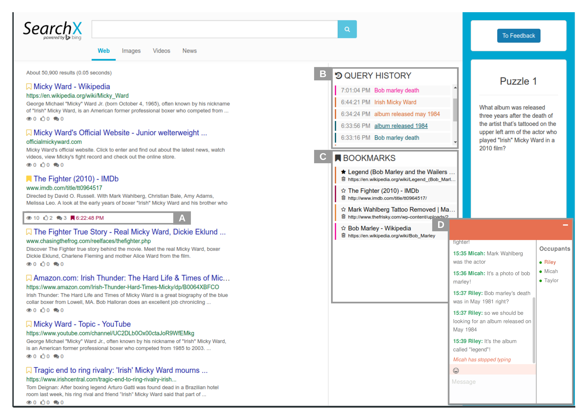

   

 

SearchX is a scalable collaborative search system being developed by [Lambda Lab](http://www.wis.ewi.tudelft.nl/projects/lambda-lab/) of [TU Delft](https://www.tudelft.nl/).
It is based on [Pienapple Search](http://onlinelibrary.wiley.com/doi/10.1002/pra2.2016.14505301122/full) and is further developed to facilitate collaborative search and sensemaking. SearchX includes features that enable crowdsourced user studies on collaborative search, and is easily extensible for new research.

 

# Documentation

SearchX is separeted in frontend and backend. 

## Frontend

Apart from serving the interface, the front end also manages user data and defines the logs sent back to the back end.
It is built on NodeJS using the [React](https://reactjs.org/) + [Flux](https://facebook.github.io/flux/) framework and is served through [webpack](https://webpack.js.org/). For more details about the frontend go to the [SearchX-frontend](https://github.com/felipemoraes/searchx-frontend) repository.

## Backend

The backend is responsible for fetching search requests to the search provider and managing the application's data. 
It is built on NodeJS and exposes its endpoints through [express](https://expressjs.com/) (API) and [socket.io](https://socket.io/) (Websockets). For more details about the frontend go to the [SearchX-backend](https://github.com/felipemoraes/searchx-backend) repository.

# People

The folowing people have been involved in researching and developing SearchX.

- Felipe Moraes - PhD student at TU Delft
- Sindunuraga Rikarno Putra - MSc student at TU Delft
- Kilian Grashoff - MSc student at TU Delft
- Claudia Hauff - Associate professor at TU Delft

# Contribution

Did you find a bug, or want to improve SearchX? You can contribute to SearchX by filing issues on the issues of the frontend or backend, or by forking and sending a pull request on Github.

# Citation
--------

If you use SearchX to produce results for your scientific publication, please refer to our [SIGIR 2018](http://fmoraes.nl/documents/moraes2018sigir.pdf) paper.

    @inproceedings{putra2018searchx,
      title={SearchX: Empowering Collaborative Search Research.},
      author={Putra, Sindunuraga Rikarno and Moraes, Felipe and Hauff, Claudia},
      booktitle={SIGIR},
      pages={1265--1268},
      year={2018}
    }
    
# Publications

<li>Sindunuraga Rikarno Putra, Kilian Grashoff, Felipe Moraes and Claudia Hauff. SearchX: Empowering Research on Collaborative Search. In <em>Proceedings of the 1st Design of Experimental Search  & Information REtrieval Systems </em>, Bertinoro, Italy, 2018. <a href="https://chauff.github.io/documents/publications/DESIRES2018-Putra.pdf">[PDF Preprint→]</a></li>
 
<li>Sindunuraga Rikarno Putra, Felipe Moraes and Claudia Hauff. SearchX: Empowering Collaborative Search Research. In <em>Proceedings of the 41st ACM SIGIR Conference on Research and Development in Information Retrieval</em>, Ann Arbor, Michigan, USA, 2018. <a href="https://chauff.github.io/documents/publications/SIGIR2018-moraes.pdf">[PDF Preprint→]</a> <a href="SIGIR2018-Demo-Poster.png"> [Poster→]</a></li>
    
# Last version

SearchX is in continuous development. The last version date and stable version is from <b>July 2018</b>.
    
